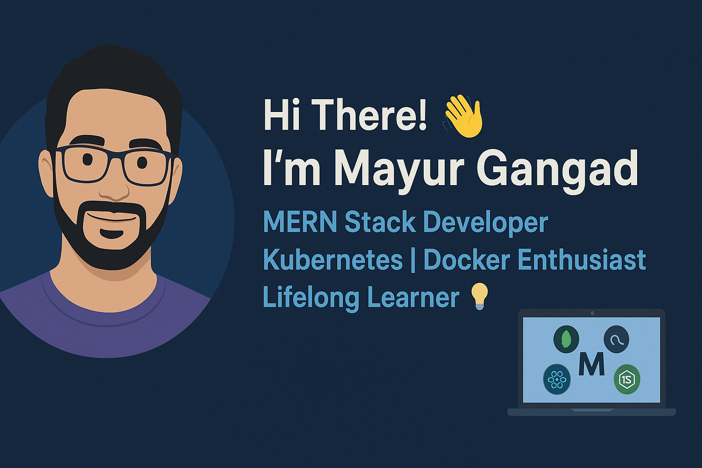

<!-- Typing SVG -->

  

<!-- Banner Image -->

  

---

## 👨‍💻 About Me  

- 💻 MERN Stack Developer passionate about building **scalable web apps**  
- 🐳 Hands-on with **Docker** & **Kubernetes** for containerization and orchestration  
- 📚 Always learning **DevOps tools** & **cloud technologies**  
- 🤝 Open to collaborating on interesting **open-source projects**  
- 📫 Reach me at: gangadmayur112@gmail.com  

---

## 🛠️ Tech Stack & Tools  

  
   
  
  
  
  
  
  
  
  

---

## 📊 GitHub Stats  

  
  

---

## 🚀 Featured Projects  

| Project Name | Description | Tech Stack |
|--------------|-------------|------------|
| **Portfolio Website** | Personal portfolio with React & TailwindCSS | React, Tailwind |
| **MERN Blog** | Full-stack blog application | MongoDB, Express, React, Node |
| **K8s Deployment** | Docker + Kubernetes Deployment setup | Docker, K8s |

---

---

## 👀 Visitor Counter  

  

---

  

